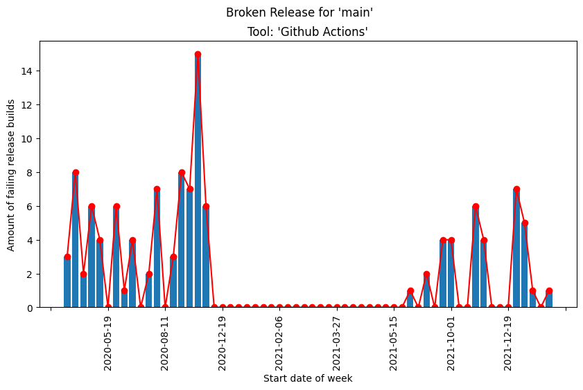
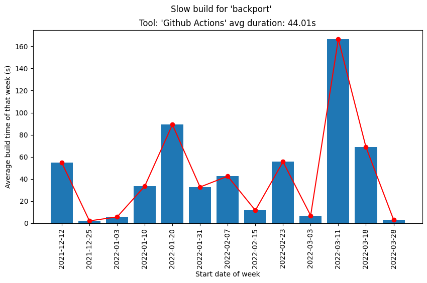

# CIAN
[](https://github.com/FreekDS/git-ci-analyzer/actions/workflows/ci-main.yml) [](https://dl.circleci.com/status-badge/redirect/gh/FreekDS/CIAN/tree/main)
> Continuous Integration Antipattern aNalyzer: a command line tool to analyze CI workflows in git repositories written in Python 3.10.

---

The goal for this project is to create a command line tool that is capable of analyzing CI implementations in Git repositories.
The focus of the analysis is on CI antipatterns.
The tool is capable of analyzing TravisCI builds and GitHub Actions builds.

Output is generated in the form of graphs and a JSON file containing the information.

## Installation
In order to install this tool, you have to follow the next steps
1. Clone this repository to your local machine <br>
   ```shell
   git clone https://github.com/FreekDS/git-ci-analyzer.git
    ```
2. Go to the cloned directory
    ```shell
   cd git-ci-analyzer/
   ```
3. Install the required dependencies
    ```shell
   pip install -r requirements.txt
   ```

### Requirements
In order to be able to install everything, make sure the following is installed on your machine
1. Python 3.10 (this is the Python version where the tool is written in, it might also work with lower Python versions)
2. pip
3. To access private repositories, and to have a higher rate limit, the following environment variables should be set
   > GH_TOKEN_COUNT=2 <br>
   > GH_TOKEN_1=<your_1st_github_token> <br>
   > GH_TOKEN_2=<your_2nd_github_token> <br>
   > CIRCLE_CI=<your_circleci_token> <br>
   > TRAVIS_CI=<your_travis_token>
   
   They can be set by creating a ```.env``` file. This file is loaded automatically.<br>
   It is advised to set at least one `GH_TOKEN` as this increases the rate limit for the GitHub API significantly.
   Any number of GitHub token can be set by increasing the value of `GH_TOKEN_COUNT` and by adding the appropriate tokens
   using the format `GH_TOKEN_#`.

## Usage
To view the usage of the tool, run
````shell
python gitci.py -h
````

There is only one required argument: the repository slugs.
A slug describes the repository you want to analyze.
It is formatted as follows
> [{provider}/]{username}/{repository_name}

The provider argument in this slug is optional. By default, the default provider is used (GitHub, see option `-p`)
For example, the slugs that point to this repository are the following

> FreekDS/git-ci-analyzer <br>
> gh/FreekDS/git-ci-analyzer <br>
> github/FreekDS/git-ci-analyzer <br>

Multiple slugs can be passed in at once. The slugs should be separated by a space.

Information of the other command line options are provided by using ```-h``` or ``--help``
`````
usage: gitci.py [-h] [-p DEFAULT_PROVIDER] [-do]
                [-a ANTI_PATTERNS [ANTI_PATTERNS ...]] [-nc] [-ncc]
                [-od OUT_DIR] [-v] [-d START_DATE]
                repository_slugs [repository_slugs ...]

positional arguments:
  repository_slugs      One or more repository slugs. A slug is constructed as
                        follows:[{provider}/]{username}/{repository_name}The
                        provider is optional. If none is given, the default
                        provider is assumed (see -p)

options:
  -h, --help            show this help message and exit
  -p DEFAULT_PROVIDER, --default-provider DEFAULT_PROVIDER
                        Default provider. Allowed values are ['github', 'gh']
  -do, --detect-only    Only detect CI tools in the specified repositories
  -a ANTI_PATTERNS [ANTI_PATTERNS ...], --anti-patterns ANTI_PATTERNS [ANTI_PATTERNS ...]
                        Select anti-patterns to detect, allowed values are
                        ['slow_build', 'broken_release', 'late_merging',
                        'skip_failing_tests']
  -nc, --no-cache       Use this flag to disable cache usage
  -ncc, --no-create-cache
                        Use this flag to disable cache creation
  -od OUT_DIR, --out-dir OUT_DIR
                        Output path
  -v, --verbose         Provide more information in console
  -d START_DATE, --start-date START_DATE
                        Date to start collecting data from, if none is
                        provided, the latest three months are collected. Date
                        should be formatted as YYYY-MM-DD
`````


### Examples

`````shell
python gitci.py FreekDS/git-ci-analyzer
python gitci.py gh/FreekDS/git-ci-analyzer godotengine/godot
python gitci.py FreekDS/git-ci-analyzer -p github
python gitci.py godotengine/godot -od C:/user/path/ -nc -ncc
python gitci.py FreekDS/git-ci-analyzer -v -a slow_build broken_release -nc
`````

## Features
At the moment, the following features are present:
1. Detect which CI tools are implemented in a repository.
2. Analyze builds to gather information on antipatterns
   1. Slow build
   2. Broken release branch
   3. Late merging
   4. Skip failing tests
3. Output to JSON, graphs and text


## Tests
Tests are located in the `tests/` folder.
They are pytest based and can be executed with
````shell
pytest .
````

## Note About Caching
If the tool is executed multiple times on the same repository, it uses the generated cache files by default since
collecting data from the GitHub or Travis API is a costly operation.
If you wish not to use the cache, the option ```-nc``` (no cache) should be used.
Do note that as long as the `````-ncc````` (no create cache) option is not present, the cache files will be overwritten.

Cache files are located under the ```cache/``` directory and can be deleted manually.

## Example Output
Repository: [pytest-dev/pytest](https://www.github.com/pytest-dev/pytest)



## License

This repository is MIT licensed.
See the [LICENSE](./LICENSE) file for more information.
